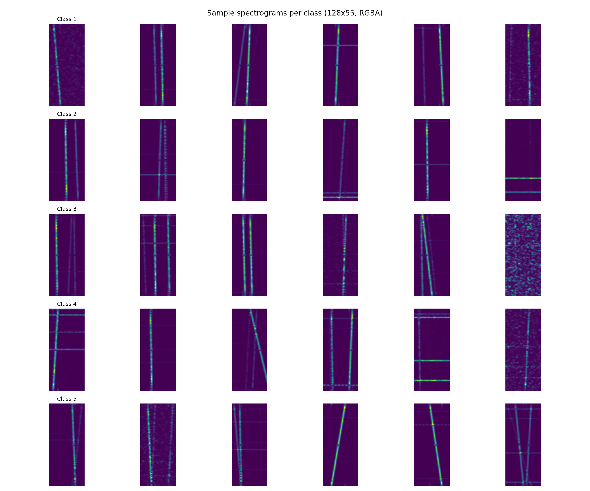

# Signal Object Detection — Counting Objects in Spectrograms

A from-scratch deep-learning solution to the Kaggle **"Signal Object Detection"** competition:
given a grayscale signal spectrogram, predict an integer label in `{1, 2, 3, 4, 5}`.
Evaluation metric: **classification accuracy**.

> **Final result: 🏆 15th / 150 on the private (final) leaderboard.**
> Kaggle **0.78690 private** / 0.78763 public
> (`submissions/submission_run30_corrected.csv`) — selected for its private-leaderboard
> score and near-zero public→private drop (−0.0007), i.e. it generalises.

This repository is the full record of the project: the model code, every numbered
experiment, the helper tooling, and a complete academic write-up — including the
**unsuccessful** experiments and *why* they failed.

---

## The key reframing: it's a counting problem

The competition looks like 5-way image classification, but the decisive insight that
shaped the whole project is that **the label is a count of objects** — each spectrogram
contains some number of thin, oriented "chirp" lines, and the label is *how many*
(an ordinal target in 1–5, not an arbitrary class identity).



This reframing has three consequences that recur throughout the work:

1. **Augmentations must preserve the count.** Frequency/time *masking* (standard
   SpecAugment) can erase an object and corrupt the label — removing it was worth
   **+3.8 pp**. Horizontal flip / rotation distort the semantic time–frequency axes
   and hurt. Only count-preserving augmentations are valid (`ColorJitter` for SNR,
   translation, mild noise).
2. **The aspect ratio is semantic.** Spectrograms are natively `128×55` (H/W ≈ 2.33).
   Squashing to a square smears objects along the time axis; feeding the network the
   **native aspect ratio** (e.g. `448×192`) was the single strongest confirmed lever
   (**+4.0 pp** public).
3. **The test set can be exploited.** The competition permits semi-supervised
   **pseudo-labeling** of the provided test images, which adds a reliable increment
   on top of the supervised ensemble.

---

## Results

### Two model families on a shared validation split

The task asks for a classical hand-crafted-feature baseline alongside a learned model.
On a common validation set the from-scratch CNN dominates every classical baseline:

| Model | Config | Val accuracy | Macro-F1 |
|---|---|---:|---:|
| **CompactSignalCNN** (OOF) | ~0.9M params, single-channel 128×64 | **57.32** | **56.04** |
| RandomForest | 400 trees | 37.26 | 34.79 |
| LogReg | C=1.0 | 28.48 | 24.28 |
| SVM-RBF | C=1.0, γ=0.01 | 28.26 | 25.83 |
| Linear-SVM | C=1.0 | 28.06 | 22.04 |
| k-NN | k=25 | 24.48 | 21.93 |

*(Generated by `src/generate_report_artifacts.py` → `docs/figures/`. Confusion
matrices for every model are in [`docs/figures/`](docs/figures).)*

### Competition leaderboard

The competition-grade model is a **from-scratch EfficientNet/MBConv** (hand-built from
PyTorch primitives — see [Competition rules](#competition-rules)), trained at native
aspect ratio with a K-fold ensemble, translation test-time augmentation, and one round
of pseudo-labeling.

| Submission | Public | Private | Notes |
|---|---:|---:|---|
| **`submission_run30_corrected.csv`** ✅ | 0.78763 | **0.78690** | **Selected best** — most stable (−0.0007) |
| `submission (13)` | 0.78981 | 0.78230 | Higher public, overfit (−0.0075) |
| `submission (11)` (≈ Run 28) | 0.78836 | 0.77381 | Higher public, overfit (−0.0146) |
| Run 27 | 0.74836 | 0.74424 | Pre-native-aspect baseline |

A central lesson: **judge by the private leaderboard, not the public score** — two
submissions with *higher public* numbers dropped hard in private. Selecting the most
*stable* submission paid off: it placed **15th of 150** on the final (private)
leaderboard. See the [experiment log](docs/EXPERIMENT_LOG.md) for the full story.

---

## Method

- **Architecture** — a from-scratch EfficientNet-style MBConv network (squeeze-excite
  blocks, compound width/depth scaling). No pretrained weights, no library
  architectures — assembled entirely from `nn.Conv2d` / `nn.Linear` / `nn.BatchNorm2d`
  primitives to satisfy the competition rules.
- **Input** — RGB spectrogram at **native aspect ratio** (`448×192`).
- **Training** — K-fold stratified cross-validation, AdamW + cosine/one-cycle schedule,
  label-smoothed cross-entropy, MixUp (with warm-up), count-preserving augmentation.
- **Inference** — softmax-averaged K-fold ensemble + **translation-only** test-time
  augmentation (multi-scale TTA was falsified: −1.88 pp).
- **Semi-supervised** — one round of top-K pseudo-labeling on the test set.
- **Validation discipline** — leakage-free out-of-fold gating; a new lever is only
  promoted if it beats the baseline **on the same fold scheme** (CV is not comparable
  across different fold schemes — a hard-won lesson).

---

## Repository structure

```
.
├── docs/
│   ├── REPORT.md            # Formal academic report (problem, methods, results, full log)
│   ├── EXPERIMENT_LOG.md    # Detailed run-by-run experiment log (every Run, hypothesis, result)
│   └── figures/             # Confusion matrices, class distributions, comparison tables
├── src/                     # Local pipeline + classical baselines + ablation probes
│   ├── model.py             #   CompactSignalCNN (custom CNN, PyTorch primitives only)
│   ├── train.py             #   Local training (stratified K-fold CV)
│   ├── predict.py           #   Local inference → submission
│   ├── generate_report_artifacts.py   # Builds the classical-vs-CNN comparison + figures
│   ├── ab_*.py              #   A/B ablation probes (input channel, resolution, capacity, aspect…)
│   └── probe_*.py           #   Diagnostic probes (object counting, Hough lines)
├── experiments/             # Numbered from-scratch GPU run scripts (the competition pipeline)
│   └── run{27,29,30,31,32}_vast.py   # Each Run is a self-contained, pinned script
├── scripts/                 # Helper tooling
│   ├── tta_probe.py                  #   Leakage-free TTA measurement (zero submissions)
│   ├── make_submission_corrected.py  #   Rebuild a submission with the correct TTA recipe
│   ├── posthoc_prior.py              #   Prior-correction experiment (falsified)
│   └── upload_dataset.py
├── notebooks/               # EDA + Colab/Kaggle TPU/GPU training notebooks
└── submissions/
    └── submission_run30_corrected.csv   # The selected best submission
```

**Note on data:** the competition images are **not** included (Kaggle terms; ~20k PNGs).
Scripts pull them via `kagglehub` or a local `DATA_PATH`. Trained weights (~14 GB) are
also excluded — see the run scripts to reproduce them.

---

## Competition rules

These were hard constraints (violations = disqualification), and they shaped every
design decision:

- **No pretrained weights** — train from random initialisation only.
- **No predefined architectures** — the network must be assembled from PyTorch
  primitives. (An early `timm`-EfficientNet line of work was retroactively invalidated;
  the current model is hand-built.)
- **No external data** — only the provided train/test sets. *(Pseudo-labeling the
  provided test set is permitted; importing outside data is not.)*
- **Max 3 submissions/day** — hence the leakage-free CV/TTA probes that validate ideas
  before spending a submission slot.

---

## Reproduction

The numbered run scripts are self-contained and were executed on a rented CUDA GPU
(e.g. vast.ai) inside `tmux`:

```bash
# Train + ensemble + pseudo-label + write a submission (on a GPU box)
DATA_PATH=/path/to/data OUT_DIR=./run30_out N_ROUNDS=1 python experiments/run30_vast.py

# Rebuild a submission with the correct (translation-only) TTA recipe
DATA_PATH=/path/to/data OUT_DIR=./run30_out python scripts/make_submission_corrected.py

# Reproduce the classical-vs-CNN comparison tables and confusion matrices
python src/generate_report_artifacts.py
```

Knobs are environment variables: `DATA_PATH`, `OUT_DIR`, `N_SPLITS`/`TRAIN_FOLDS`,
`N_ROUNDS` (pseudo-label rounds), `EPOCHS`, `ES_PATIENCE`/`ES_GUARD`. If `DATA_PATH`
is unset the data is pulled with `kagglehub`.

Dependencies: see [`requirements.txt`](requirements.txt) (`torch`, `torchvision`,
`pandas`, `numpy`, `scikit-learn`, `Pillow`, `kagglehub`).

---

## Documentation

- 📄 **[Formal report](docs/REPORT.md)** — the academic write-up: problem framing,
  both model families, validation protocol, results, and reproduction.
  *(15th / 150 on the final private leaderboard.)*
- 🧪 **[Experiment log](docs/EXPERIMENT_LOG.md)** — the complete run-by-run history,
  including every dead end and the reasoning behind each decision.

---

## License

Released under the [MIT License](LICENSE). The competition dataset is **not** covered
by this license and is subject to Kaggle's competition terms.
